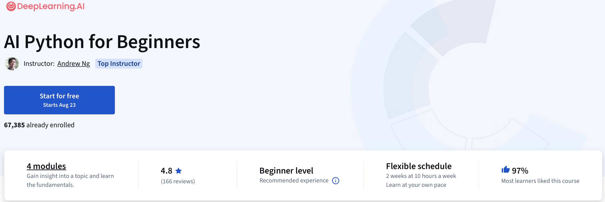
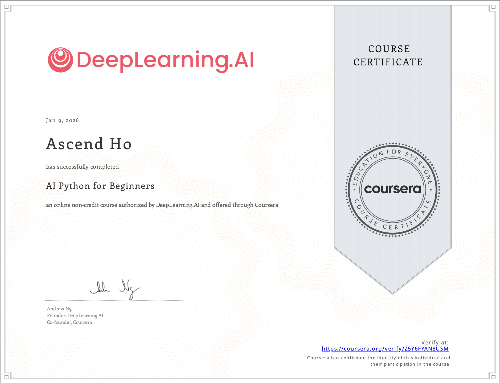

# AI Python for Beginners

> 这门包含四个部分的课程从第一天起就教你编写实用的 AI 应用程序，在学习 Python 基础的同时用它来构建 AI 驱动的工具，比如自定义食谱生成器、智能待办清单和旅行规划器，在此过程中掌握变量、函数、循环和数据结构等基本编程概念。随着学习的深入，你将使用自己的数据，从文本文件和结构化数据中提取有价值的信息，包括让 AI 分析旅行博客并生成个性化行程，以此规划一场理想的旅行！
>
> 完成这一系列课程后，你将能够编写与大型语言模型交互的 Python 脚本、实现任务自动化并分析自己的数据。你甚至会学习如何借助用于数据分析和可视化的热门第三方库来扩展 Python 的功能，以及如何通过 API 获取实时信息。这些技能在从科技、金融到医疗健康和创意领域等众多行业中，价值都在日益提升。
>

本仓库为个人对该课程的学习记录，包括课程中演示的源代码，习题解答和课件等资源。所有内容仅供学习参考，不得私自挪为它用。

## 许可证

本仓库中所有资源的版权归属coursera课程平台和原作者所有，本人仅用于记录学习过程，并为其他所需要的人提供参考。

## 结课证书

